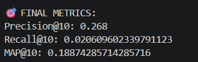
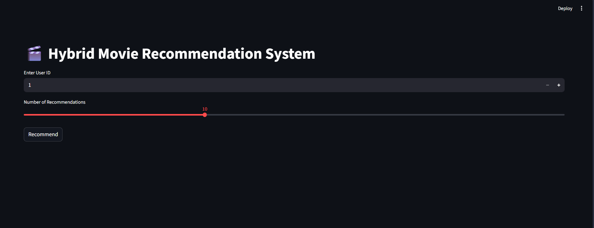
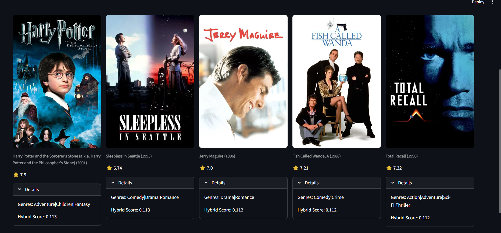

# Hybrid-Netflix-style-recommendation-system

A powerful Hybrid Recommender System that combines multiple machine learning techniques (Collaborative Filtering, Machine Learning, Clustering, and Deep Learning) to generate personalized movie recommendations.

# 🚀 Overview
```
This project builds a hybrid recommendation engine by combining:
•	📊 Collaborative Filtering (SVD, KNN)
•	🤖 Machine Learning (XGBoost)
•	🧠 Deep Learning (LSTM)
•	👥 Clustering (KMeans + DBSCAN)
The final recommendations are generated using a weighted hybrid scoring system, where weights are tuned using Random Search Optimization.
```
# Dataset

This project uses MovieLens20M dataset available in Kaggle. You can download it from here <a>https://www.kaggle.com/datasets/grouplens/movielens-20m-dataset<a>.
It contains 20000263 ratings and 465564 tag applications across 27278 movies. These data were created by 138493 users between January 09, 1995 and March 31, 2015. This dataset was generated on October 17, 2016. 

```
In the dataset archive, only these csv files are used in this project for model training and evaluation:

movie.csv
rating.csv
tag.csv
```

UI(streamlit) usage only:
link.csv - It is used to download the movie posters and ratings that match the tmbdId.

🎯 Features
```
•	Personalized movie recommendations
•	Hybrid model combining 5 different techniques
•	Tuned weights for optimal performance
•	Streamlit web application
•	Poster fallback system (image/text-based)
•	Cold-start handling for new users
•	Efficient data handling using Parquet format
```

Please download "processed_df.parquet" from here <a>https://drive.google.com/file/d/1bZNUtn5RN9b4jkpYDwG3uIuHXRYk0bYG/view?usp=sharing<a>, and "models" folder from here: <a>https://drive.google.com/drive/folders/1kee3-iM8Wa28ba6ebbZ1Tv2npiJlqJUL?usp=sharing<a> and add in your project folder in the same structure as shown below:

🏗️ Project Structure
```
├── app.py                     # Streamlit application
├── processed_df.parquet       # Processed ratings dataset
├── movie.parquet              # Movie metadata
├── movie_metadata.parquet     # Posters and ratings
├── requirements.txt
├── models/
│   ├── svd_model.pkl
│   ├── knn_model.pkl
│   ├── xgb_model.pkl
│   ├── lstm_model.h5
│   ├── movie_map.pkl
│   ├── feature_cols.pkl
│   ├── user_features.csv
│   ├── kmeans_cluster_rating.pkl
│   ├── dbscan_cluster_rating.pkl
│   ├── best_weights.pkl
├── src/
│   ├── hybrid.py
│   ├── scores.py
│   ├── cold_start.py
│   ├── utils.py
├── notebooks/
│   ├── colloborative filtering.ipynb
│   ├── clustering.ipynb
│   ├── lstm.ipynb
│   ├── Data_preprocessing.ipynb
│   ├── evaluate_withouttuning.ipynb
images/
│   ├── metrics.png
│   ├── UI.png
│   ├── Output.png
├── tuning.py                  # Random search tuning
├── evaluation.py              # Metrics evaluation
```

# 🧠 Hybrid Model Architecture
```
Final score is computed as:
Final Score =
    w1 * SVD +
    w2 * KNN +
    w3 * XGBoost +
    w4 * Cluster +
    w5 * LSTM
Where:
•	Weights (w1–w5) are optimized using random search
•	Each model contributes to the final ranking
```

# ⚙️ Step-by-Step Pipeline
```
1️⃣ Data Preprocessing
•	Load datasets
•	Handle missing values
•	Sort by timestamp
•	Create movie_encoded for LSTM
•	Split into train/test (user-wise split)
2️⃣ Model Training
SVD (Collaborative Filtering)
•	Learns latent user-item interactions
KNN (Similarity-based)
•	Finds similar users/items
XGBoost
•	Predicts rating using engineered features:
  o	user_avg_rating
  o	movie_avg_rating
  o	rating counts
Clustering
•	KMeans & DBSCAN applied on user features
•	Compute cluster-level movie ratings
LSTM
•	Learns sequential viewing behavior
•	Uses movie sequences per user
3️⃣ Hybrid Model (final_hybrid)
•	Generate candidate movies (top popular unseen)
•	Compute scores from all models
•	Normalize and combine using weights
•	Rank and return top-N recommendations
4️⃣ Hyperparameter Tuning
•	Used Random Search to optimize weights
•	Evaluated using Precision@10
•	Best weights saved in:
    models/best_weights.pkl
5️⃣ Evaluation Metrics
•	Precision@K
•	Recall@K
•	MAP
6️⃣ Streamlit Application
•	User inputs user_id
•	Displays:
 o	Movie posters
 o	Ratings
 o	Genres
 o	Hybrid score
•	Handles missing posters with generated images
```
# 🧪 How to Run
```
1️⃣ Clone the repository
git clone https://github.com/your-username/hybrid-recommender.git
cd hybrid-recommender
2️⃣ Install dependencies
pip install -r requirements.txt
3️⃣ Run the app
streamlit run app.py
```

# 🔧 Tuning
```
To re-run tuning:
python tuning.py
This will:
•	Run random search
•	Find best weights
•	Save them automatically
```

# Evaluation
```
Metric	        Value
Precision@10	 0.268
Recall@10	     0.020609602339791123
MAP@10           0.18874285714285716
```

The evaluation output is as follows:



# 📌 Key Learnings
```
•	Hybrid systems outperform single models
•	Feature engineering is critical for XGBoost
•	Sequence models (LSTM) improve personalization
•	Weight tuning significantly boosts performance
```

# 🚀 Future Improvements
```
•	Replace weighted hybrid with Learning-to-Rank model.
•	Use NLP to analyse movie tag features and improve movie recommendations.
•	Use transformer-based sequence models.
•	Deploy using cloud services.
```
# Streamlit output

The streamlit application UI is as follows:


The user id can be increased or decreased. If any user who are not present in this 20M dataset is provided, it is handled using cold start approach. The TOP-N movie recommendations can be adjusted using the slider. For example, for user id "4", the TOP-5 recommended movies are as follows:



# 👩‍💻 Author
Pradheesha V


